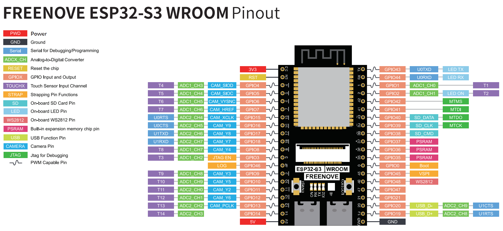

# ESP32-S3 N16R8 - MicroSD Card Test

Project ini merupakan pengujian penggunaan MicroSD Card onboard pada board ESP32-S3 N16R8 Camera Module menggunakan interface SDMMC 1-bit.

Program melakukan beberapa pengujian:

- Inisialisasi SD Card
- Deteksi tipe SD Card
- Membaca kapasitas SD Card
- Membaca total storage
- Membaca storage yang sudah digunakan
- Membuat dan menulis file /test.txt
- Membaca kembali isi /test.txt

---

## 1. Hardware

### Board

- ESP32-S3 N16R8 Camera Module
- Flash: 16 MB
- PSRAM: 8 MB OPI
- Onboard MicroSD Card Slot

### Storage

- MicroSD Card
- Disarankan menggunakan FAT32 untuk pengujian awal

---

# 2. Interface MicroSD

Pada board ESP32-S3 N16R8 Camera Module, slot MicroSD menggunakan interface SDMMC.

Project ini menggunakan mode:

SDMMC 1-bit

Konfigurasi pin yang digunakan:

| Fungsi SD Card | GPIO ESP32-S3 |
|----------------|---------------|
| SD_CMD         | GPIO38        |
| SD_CLK         | GPIO39        |
| SD_DATA0       | GPIO40        |

Diagram koneksi:

ESP32-S3 N16R8
|
|-- GPIO38 -> SD_CMD
|
|-- GPIO39 -> SD_CLK
|
`-- GPIO40 -> SD_DATA0

Karena MicroSD sudah tersedia pada board, tidak diperlukan wiring eksternal.

MicroSD cukup dimasukkan ke slot MicroSD yang tersedia pada board.

---

# 3. SDMMC vs SPI

Pada project ini digunakan interface SDMMC, bukan SPI.

Library yang digunakan:

#include <SD_MMC.h>

Tidak menggunakan:

#include <SD.h>
#include <SPI.h>

Perbedaan interface:

SPI:
- CS
- SCK
- MOSI
- MISO

SDMMC:
- CLK
- CMD
- DATA0

Konfigurasi yang digunakan pada board:

- GPIO38 -> SD_CMD
- GPIO39 -> SD_CLK
- GPIO40 -> SD_DATA0

Mode yang digunakan:
- SDMMC 1-bit
- Mode 1-bit dipilih karena hanya menggunakan satu jalur data, yaitu DATA0.

---

# 4. Arduino IDE Configuration
Gunakan konfigurasi berikut pada Arduino IDE.

- Board: ESP32S3 Dev Module
- USB CDC On Boot: Enabled
- Flash Size: 16MB
- PSRAM: OPI PSRAM
- Upload Speed: 115200 atau sesuai kebutuhan
- Port: Sesuaikan dengan COM port ESP32-S3

---

# 5. Library

Library utama yang digunakan:

Arduino.h
SD_MMC.h

Include:

#include <Arduino.h>
#include <SD_MMC.h>

Tidak diperlukan library tambahan untuk komunikasi SD Card.

Library SD_MMC sudah tersedia pada Arduino ESP32 Core.

---

# 6. Konfigurasi Pin

## ESP32-S3 N16R8 Pinout

Pin SDMMC didefinisikan pada bagian awal program:

#define SD_CMD  38
#define SD_CLK  39
#define SD_D0   40

Keterangan:
- SD_CMD: GPIO38 digunakan sebagai jalur command SD Card.
- SD_CLK: GPIO39 digunakan sebagai clock SD Card.
- SD_D0: GPIO40 digunakan sebagai jalur data pertama SD Card.

---

# 7. Inisialisasi SDMMC

Pin SDMMC dikonfigurasi menggunakan:
SD_MMC.setPins(
    SD_CLK,
    SD_CMD,
    SD_D0
);

Kemudian SD Card diinisialisasi menggunakan:
SD_MMC.begin("/sdcard", true)

Parameter kedua bernilai true yang menunjukkan penggunaan mode 1-bit.
Contoh:

if (!SD_MMC.begin("/sdcard", true)) {
    Serial.println("ERROR: SD Card gagal diinisialisasi!");
    return;
}

- Jika proses berhasil: SD Card berhasil! akan ditampilkan pada Serial Monitor.

---

# 8. Deteksi Tipe SD Card

Program akan membaca tipe SD Card menggunakan:

SD_MMC.cardType();

Beberapa tipe yang dapat terdeteksi:
- MMC
- SDSC
- SDHC
- UNKNOWN
Contoh output:
- Card Type: SDHC

---

# 9. Membaca Kapasitas SD Card

Program membaca kapasitas SD Card menggunakan:
- SD_MMC.cardSize();
- Ukuran kemudian dikonversi menjadi MB: cardSize / (1024 * 1024)
- Contoh output: Card Size: 30528 MB
Nilai aktual bergantung pada kapasitas MicroSD yang digunakan.

---

# 10. Membaca Total Storage

Program juga membaca total storage menggunakan:
SD_MMC.totalBytes();
Contoh output: Total Space: 30500 MB
Nilai dapat sedikit berbeda dari kapasitas nominal yang tertulis pada MicroSD.

---

# 11. Membaca Storage yang Digunakan

- Storage yang sudah digunakan dibaca menggunakan: SD_MMC.usedBytes();
- Contoh: Used Space: 1 MB
Nilai ini akan bertambah apabila semakin banyak file yang disimpan pada MicroSD.

---

# 12. Write Test

Program membuat atau membuka file:
- /test.txt

File dibuka menggunakan:
- SD_MMC.open("/test.txt", FILE_APPEND);
- FILE_APPEND digunakan agar data baru ditambahkan ke bagian akhir file.

Data yang ditulis:
- - - - - - - - - - - - -
Hello ESP32-S3 N16R8 CAM
SD Card test berhasil.
- - - - - - - - - - - - - 

- Setelah proses penulisan selesai: file.close();
digunakan untuk menutup file.

---

# 13. Read Test

- Setelah proses write selesai, program membuka kembali: /test.txt
- menggunakan: SD_MMC.open("/test.txt", FILE_READ);
- Kemudian isi file dibaca menggunakan:

while (file.available()) {
    Serial.write(file.read());
}

Isi file akan ditampilkan pada Serial Monitor.

Contoh:
- - - - - - - - - - - - -
Hello ESP32-S3 N16R8 CAM!
SD Card test berhasil.
- - - - - - - - - - - - -

Read berhasil!

---

# 14. Program Flow

Alur program:

ESP32-S3 Start
|
v
Serial Initialization
|
v
Set SDMMC Pins
|
|-- GPIO38 -> SD_CMD
|-- GPIO39 -> SD_CLK
`-- GPIO40 -> SD_DATA0
|
v
Initialize SD Card
|
+-- FAIL
|   |
|   `-- Print Error
|
`-- SUCCESS
    |
    v
Detect Card Type
    |
    v
Read Card Size
    |
    v
Read Total Space
    |
    v
Read Used Space
    |
    v
Write /test.txt
    |
    v
Read /test.txt
    |
    v
Test Complete

---

# 15. Expected Serial Monitor

Jika MicroSD berhasil terdeteksi, output kurang lebih:

= = = = = = = = = = = = = = = = =
 ESP32-S3 N16R8 CAM
 MICRO SD CARD TEST
= = = = = = = = = = = = = = = = =

Setting SDMMC pins...
SDMMC pins OK

Initializing SD Card...

SD Card berhasil!

Card Type: SDHC
Card Size: 30528 MB
Total Space: 30500 MB
Used Space: 1 MB

Writing /test.txt...

Write berhasil!

Reading /test.txt...

- - - - - - - - - - - - -
Hello ESP32-S3 N16R8 CAM!
SD Card test berhasil.
- - - - - - - - - - - - -

Read berhasil!

= = = = = = = = = = = = = = = = =
 SD CARD TEST SELESAI
= = = = = = = = = = = = = = = = =
Nilai Card Size, Total Space, dan Used Space bergantung pada kondisi dan kapasitas MicroSD yang digunakan.

---

# 16. File yang Dibuat

Program akan membuat file:

/test.txt

Isi file:

Hello ESP32-S3 N16R8 CAM!
SD Card test berhasil.
- - - - - - - - - - - - -

Karena menggunakan FILE_APPEND, data baru akan ditambahkan pada bagian akhir file setiap kali program dijalankan.

Contoh setelah beberapa kali program dijalankan:

Hello ESP32-S3 N16R8 CAM!
SD Card test berhasil.
- - - - - - - - - - - - -
Hello ESP32-S3 N16R8 CAM!
SD Card test berhasil.
- - - - - - - - - - - - -
Hello ESP32-S3 N16R8 CAM!
SD Card test berhasil.
- - - - - - - - - - - - -

---

# 17. Troubleshooting

## SD Card gagal diinisialisasi

Jika muncul:
Initializing SD Card...
ERROR: SD Card gagal diinisialisasi!
Periksa beberapa hal berikut.

### 1. Pastikan MicroSD terpasang
Pastikan MicroSD sudah dimasukkan dengan benar ke slot MicroSD pada board.

### 2. Periksa format MicroSD
Untuk pengujian awal, gunakan filesystem:
- FAT32

### 3. Periksa konfigurasi pin
Pastikan program menggunakan:
#define SD_CMD  38
#define SD_CLK  39
#define SD_D0   40

### 4. Periksa mode SDMMC
Pastikan menggunakan:
SD_MMC.begin("/sdcard", true)
Parameter true digunakan untuk mode SDMMC 1-bit.

### 5. Coba MicroSD lain
Jika board tidak dapat membaca kartu, coba menggunakan MicroSD lain yang sudah dipastikan berfungsi.
---

# 18. SD Card Tidak Menggunakan GPIO CS
Pada konfigurasi SDMMC 1-bit ini tidak digunakan pin CS seperti pada komunikasi SPI.
Karena itu tidak diperlukan konfigurasi seperti:
#define SD_CS 1

Konfigurasi SDMMC menggunakan:
- GPIO38 -> CMD
- GPIO39 -> CLK
- GPIO40 -> DATA0
Jangan menggunakan konfigurasi SPI berikut untuk MicroSD onboard:
- CS
- SCK
- MOSI
- MISO
Konfigurasi tersebut digunakan untuk SD Card yang terhubung sebagai perangkat SPI eksternal.

---

# 19. Struktur Repository

Struktur repository yang disarankan:
ESP32S3-N16R8-MicroSD/
|
|-- README.md
|
|-- src/
|   `-- ESP32S3_SDCard.ino
|
`-- docs/
    `-- images/
        `-- ESP32S3_N16R8_Pinout.jpg

README.md berisi dokumentasi project.

src/ESP32S3_SDCard.ino berisi program utama.

docs/images/ESP32S3_N16R8_Pinout.jpg berisi gambar referensi pinout board.

- - -

# 20. Pengembangan Selanjutnya

Setelah pengujian MicroSD berhasil, project dapat dikembangkan menjadi data logger.

Contoh struktur file:

/
|
|-- test.txt
|
`-- gps_log.csv

Data GPS dapat disimpan dalam format CSV:

timestamp,latitude,longitude,altitude,speed,satellites

2026-10-06 14:00:01,-6.057910,106.680896,12.4,3.2,8
2026-10-06 14:00:02,-6.057915,106.680901,12.5,3.4,8
2026-10-06 14:00:03,-6.057920,106.680905,12.5,3.5,9

Dengan konfigurasi tersebut, ESP32-S3 N16R8 dapat digunakan sebagai GPS Data Logger dengan penyimpanan data pada MicroSD onboard.

---

# 21. Status Project

Current status:
- [x] SDMMC initialization
- [x] SD Card detection
- [x] Card type detection
- [x] Card size detection
- [x] Total storage detection
- [x] Used storage detection
- [x] File write test
- [x] File read test
- [ ] GPS data logging
- [ ] CSV data logging
- [ ] Automatic timestamp
- [ ] GPS + SD Card integration

---
