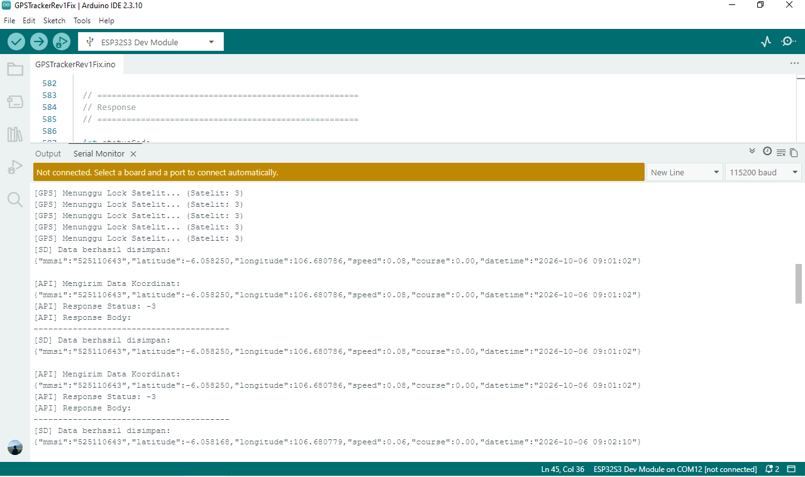
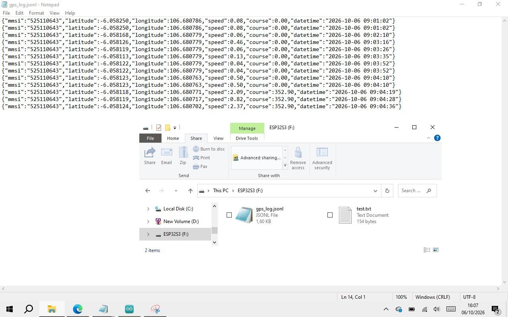

# ESP32-S3 N16R8 GPS Tracker + MicroSD
Project GPS Tracker menggunakan ESP32-S3 N16R8, NEO-M8N, WiFi, Server API, dan MicroSD onboard.

## Fitur
- Membaca koordinat dari NEO-M8N
- Mengirim data GPS ke Server setiap 5 detik
- Menyimpan data GPS ke MicroSD
- Data tetap tersimpan saat WiFi terputus
- Format log menggunakan JSON Lines (.jsonl)

## Wiring

### NEO-M8N ke ESP32-S3
- NEO-M8N TX  -> GPIO 16
- NEO-M8N RX  -> GPIO 17
- NEO-M8N GND -> GND
- NEO-M8N VCC -> 5V

### Onboard MicroSD
- SDMMC CMD -> GPIO 38
- SDMMC CLK -> GPIO 39
- SDMMC D0  -> GPIO 40
MicroSD menggunakan SDMMC 1-bit mode.

## Flow Simulasi ESP32S3 sampai ke Server
```text
              ┌───────────────┐
              │   GPS NEO-M8N │
              └───────┬───────┘
                      │
                      ▼
                ┌───────────┐
                │  ESP32-S3 │
                └─────┬─────┘
                      │
               GPS valid
                      │
             ┌────────┴────────┐
             ▼                 ▼
       ┌──────────┐       ┌──────────┐
       │ MicroSD  │       │   WiFi   │
       │  JSONL   │       │  HTTPS   │
       └──────────┘       └────┬─────┘
                               │
                               ▼
                         ┌───────────┐
                         │   Server  │
                         └───────────┘
```


## Cara Kerja


Data GPS disimpan setiap 5 detik apabila koordinat valid.

## Format Data
{
  "mmsi": "525110643",
  "latitude": -6.057910,
  "longitude": 106.680896,
  "speed": 5.25,
  "course": 182.40,
  "datetime": "2026-10-06 08:26:35"
}

### Serial Monitor



File penyimpanan:
- /gps_log.jsonl

## Noted Format Penyimpanan
Data GPS pada MicroSD disimpan menggunakan format JSON Lines (JSONL).

JSONL dipilih karena GPS melakukan pencatatan data secara berkala setiap 5 detik. Setiap data GPS disimpan sebagai satu baris JSON baru, sehingga data dapat ditambahkan (append) tanpa harus membaca atau menulis ulang seluruh file.

Contoh:
- {"mmsi":"525110643","latitude":-6.057910,"longitude":106.680896,"speed":5.25,"course":182.40,"datetime":"2026-10-06 08:26:35"}
- {"mmsi":"525110643","latitude":-6.057920,"longitude":106.680910,"speed":5.30,"course":182.50,"datetime":"2026-10-06 08:26:40"}
Penggunaan JSONL hanya berlaku untuk penyimpanan data pada MicroSD sebagai log lokal.

Format JSONL tidak memengaruhi pengiriman data ke server Server. Data yang sama tetap dibuat menjadi JSON payload dan dikirim menggunakan HTTP POST ke API Server.

### SD Card Module

